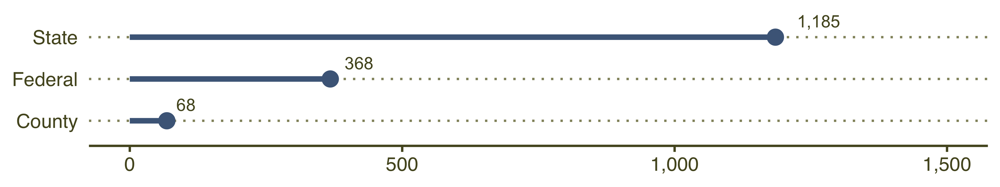
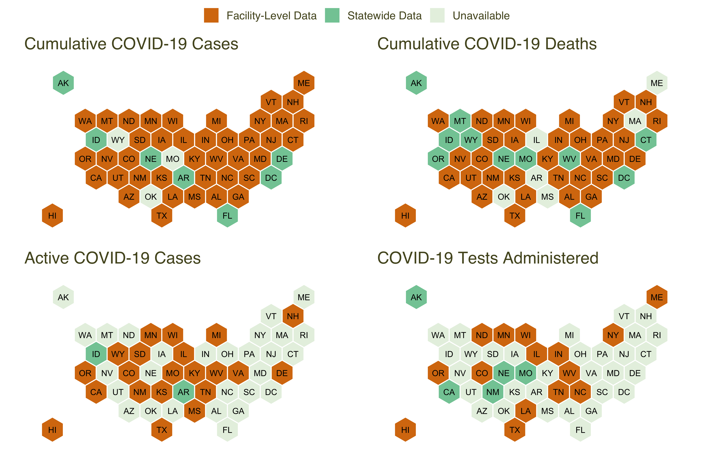
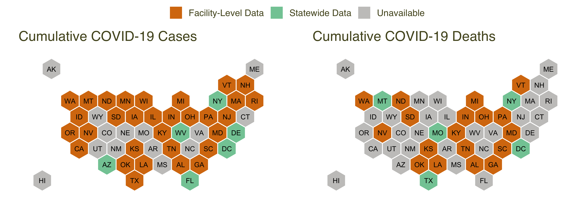

# UCLA Law COVID-19 Behind Bars Data

## Background

The [UCLA Law COVID-19 Behind Bars Data
Project](https://uclacovidbehindbars.org/), launched in March 2020,
tracks the spread and impact of COVID-19 in American carceral facilities
and advocates for greater transparency and accountability around the
pandemic response of the carceral system. Since March, we have been
collecting and reporting facility-level data on COVID-19 in prisons,
jails, and other correctional centers.

  - **Latest data**: Our latest data on COVID-19 in jails and prisons is
    maintained in this repository
    [here](https://github.com/uclalawcovid19behindbars/data/tree/master/Adult%20Facility%20Counts).  
  - **Historical data**: We are in the process of cleaning our
    historical data, available for several states in [our
    `historical-data`
    repository](https://github.com/uclalawcovid19behindbars/historical-data/tree/main/data).
  - **Additional data**: We also collect information about
    pandemic-related prison and jail releases, legal filings and court
    orders bearing on the safety of incarcerated people, and grassroots
    organizing campaigns and fundraisers in [this Google
    Sheet](https://docs.google.com/spreadsheets/u/2/d/1X6uJkXXS-O6eePLxw2e4JeRtM41uPZ2eRcOA_HkPVTk/edit#gid=1641553906).

## Our Process

Our core dataset includes information on COVID-19 cases, deaths, and
tests across more than 1,500 state, federal, and county facilities. We
maintain this dataset by scraping and standardizing data from more than
80 sources. We scrape this data 3-4 times each week, although
correctional agencies vary in how often they update their data. Our
[scraper production
code](https://github.com/uclalawcovid19behindbars/covid19_behind_bars_scrapers)
and [more detailed
documentation](https://uclalawcovid19behindbars.github.io/covid19-behind-bars-public-docs/scraper_documentation/)
are available on GitHub.

The majority of the facilities that we collect data on fall under state
jurisdiction, where COVID-19 data is reported on state Department of
Correction (DOC) websites. We also collect data from federal prisons
reported by the [Federal Bureau of
Prisons](https://www.bop.gov/coronavirus/) and from several large county
jail systems – including [Los
Angeles](https://lasd.org/covid19updates/), [New York
City](https://doccs.ny.gov/doccs-covid-19-report),
[Philadelphia](https://www.phila.gov/programs/coronavirus-disease-2019-covid-19/testing-and-data/#/philadelphia-prisons-covid-19-data),
[Maricopa
County](https://www.maricopa.gov/5574/COVID-19-in-County-Jails), [Orange
County](https://ocsheriff.gov/about-ocsd/covid-19/covid-19-oc-jails),
[Cook
County](https://www.cookcountysheriff.org/covid-19-cases-at-ccdoc/), and
[Hennepin
County](https://www.hennepinsheriff.org/jail-warrants/jail-information/COVID-19).

**Contributors**: Much of our data from jails in California is collected
by [Davis Vanguard](https://www.davisvanguard.org/), who have been
generously sharing their COVID-19 data with us. If you would like to
contribute data on COVID-19 in a facility that we don’t currently
include, please see [our
template](https://docs.google.com/spreadsheets/d/1cqjCvbXuUh5aIQeJ4NRKdUwVAb4adaWTK-nBPFAj0og/edit#gid=363817589).
We always welcome additional contributors\!

### Number of Facilities by Jurisdiction

We are continuously adding to and refining our scrapers. Where possible,
we have also retrospectively added COVID-19 data for facilities using
digital archives. We are currently in the process of cleaning our
historical scraped data and integrating population data to more readily
compute COVID-19 rates across facilities over the course of the
pandemic. This data is available for several states
[here](https://github.com/uclalawcovid19behindbars/historical-data/tree/main/data).
We are also developing an R package
[`behindbarstools`](https://github.com/uclalawcovid19behindbars/behindbarstools),
which includes a variety of functions to help pull, clean, wrangle, and
visualize our data.

## Our Data

Our core dataset includes the following metrics – reported separately
for incarcerated people and staff at the facility level:

  - Cumulative COVID-19 cases
  - Cumulative COVID-19 deaths
  - Active COVID-19 cases
  - COVID-19 tests administered

Not all jurisdictions report COVID-19 metrics at the facility level.
Some DOCs only report statewide totals, and others do not report any
data for certain metrics. Authorities also vary dramatically in how they
define the metrics that they report. We do our best to standardize these
variables, but comparing data across jurisdictions and over time should
be done with caution.

**Note**: Jurisdictions are continuously updating how, where, and
whether they update their data. We do our best to accurately collect as
much data as possible, but our data availability is subject to change.
The maps below show the data that we currently include in our core
dataset. This typically corresponds to the data that DOCs report on
their websites, but there may be instances when DOC report data that we
are unable to scrape.

### Data Availability for Incarcerated Residents in State Prisons

The maps below summarize our data availability for our four core metrics
among incarcerated people in state prisons For example, [California’s
DOC](https://www.cdcr.ca.gov/covid19/population-status-tracking/)
reports facility-level data on cumulative COVID-19 cases for residents,
while [Florida’s DOC](http://www.dc.state.fl.us/comm/covid-19.html) only
reports statewide totals. The [Federal Bureau of
Prisons](https://www.bop.gov/coronavirus/) reports facility-level data
on cumulative cases and deaths, but not active cases or tests
administered.

### Data Availability for Staff in State Prisons

The maps below summarize our data availability for cumulative COVID-19
cases and deaths among staff in state prisons We try to include data
only for correctional staff who work within facility walls and exclude
administrative staff. When agencies don’t distinguish between different
types of staff in their reporting, we include data for all reported
staff.

## Data Dictionary

| Variable               | Description                                                                                                                                                    |
| ---------------------- | -------------------------------------------------------------------------------------------------------------------------------------------------------------- |
| `Facility.ID`          | Integer ID that uniquely identifies every facility                                                                                                             |
| `Jurisdiction`         | Whether the facility falls under `state`, `county` or `federal` jurisdiction                                                                                   |
| `State`                | State where the facility is located                                                                                                                            |
| `Name`                 | Facility name                                                                                                                                                  |
| `Date`                 | Date data was scraped (not necessarily date updated by the reporting source)                                                                                   |
| `source`               | Source from which the data was scraped                                                                                                                         |
| `Residents.Confirmed`  | Cumulative number of incarcerated individuals infected with COVID-19                                                                                           |
| `Staff.Confirmed`      | Cumulative number of staff infected with COVID-19                                                                                                              |
| `Residents.Deaths`     | Cumulative number of incarcerated individuals who died from COVID-19                                                                                           |
| `Staff.Deaths`         | Cumulative number of staff who died from COVID-19                                                                                                              |
| `Residents.Recovered`  | Cumulative number of incarcerated individuals who recovered from COVID-19                                                                                      |
| `Staff.Recovered`      | Cumulative number of staff who recovered from COVID-19                                                                                                         |
| `Residents.Tadmin`     | Cumulative number of incarcerated individuals tested for COVID-19                                                                                              |
| `Staff.Tested`         | Cumulative number of staff tested for COVID-19                                                                                                                 |
| `Residents.Negative`   | Cumulative number of incarcerated individuals who tested negative for COVID-19                                                                                 |
| `Staff.Negative`       | Cumulative number of staff who tested negative for COVID-19                                                                                                    |
| `Residents.Pending`    | Cumulative number of incarcerated individuals with pending test results for COVID-19                                                                           |
| `Staff.Pending`        | Cumulative number of staff with pending test results for COVID-19                                                                                              |
| `Residents.Quarantine` | Cumulative number of incarcerated individuals in quarantine from COVID-19                                                                                      |
| `Staff.Quarantine`     | Cumulative number of staff in quarantine from COVID-19                                                                                                         |
| `Residents.Active`     | Non-cumulative number of incarcerated individuals infected with COVID-19                                                                                       |
| `Residents.Population` | Facility population if reported by the source                                                                                                                  |
| `hifld_id`             | The facility’s corresponding [Homeland Infrastructure Foundation-Level Data](https://hifld-geoplatform.opendata.arcgis.com/datasets/prison-boundaries/data) ID |
| `Notes`                | Notes from UCLA Law COVID-19 Behind Bars staff                                                                                                                 |

Additional geographic fields: `Address`, `Zipcode`, `City`, `County`,
`Latitude`, `Longitude`, `County.FIPS`.

## Citations

Citations for academic publications and research reports:

> Sharon Dolovich, Aaron Littman, Kalind Parish, Grace DiLaura, Chase
> Hommeyer, Michael Everett, Hope Johnson, Neal Marquez, and Erika
> Tyagi. UCLA Law Covid-19 Behind Bars Data Project: Jail/Prison
> Confirmed Cases Dataset \[date you downloaded the data\]. UCLA Law,
> 2020, <https://uclacovidbehindbars.org/>.

Citations for media outlets, policy briefs, and online resources:

> UCLA Law Covid-19 Behind Bars Data Project,
> <https://uclacovidbehindbars.org/>.

## License

Our data is licensed under a [Creative Commons
Attribution-NonCommercial-ShareAlike 4.0 International
License](https://creativecommons.org/licenses/by-nc-sa/4.0/). That means
that you must give appropriate credit, provide a link to the license,
and indicate if changes were made. You may not use our work for
commercial purposes, which means anything primarily intended for or
directed toward commercial advantage or monetary compensation.
